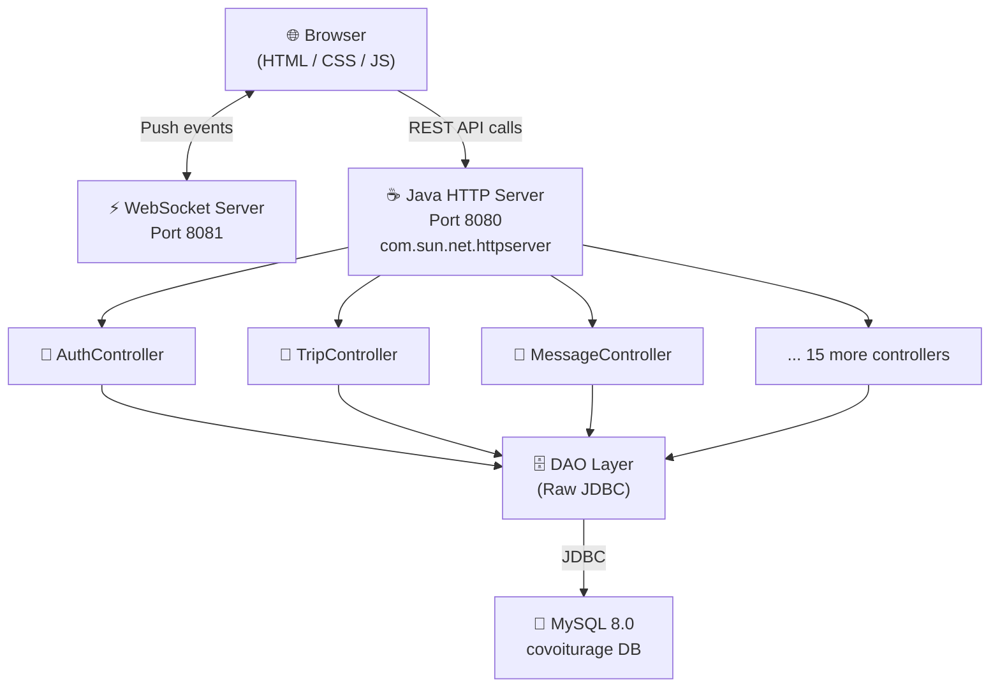
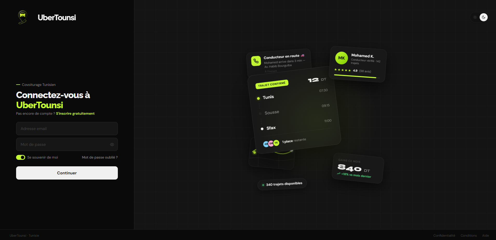
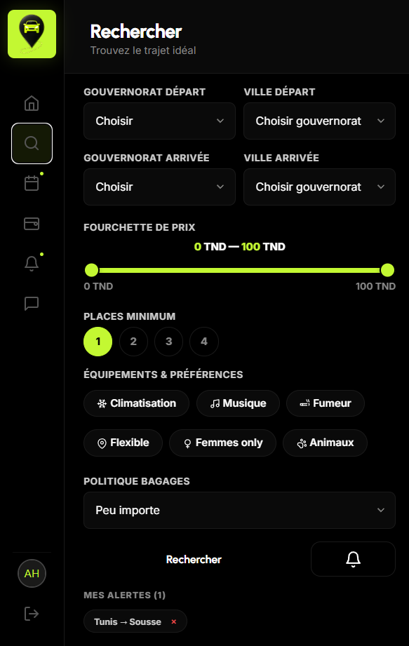
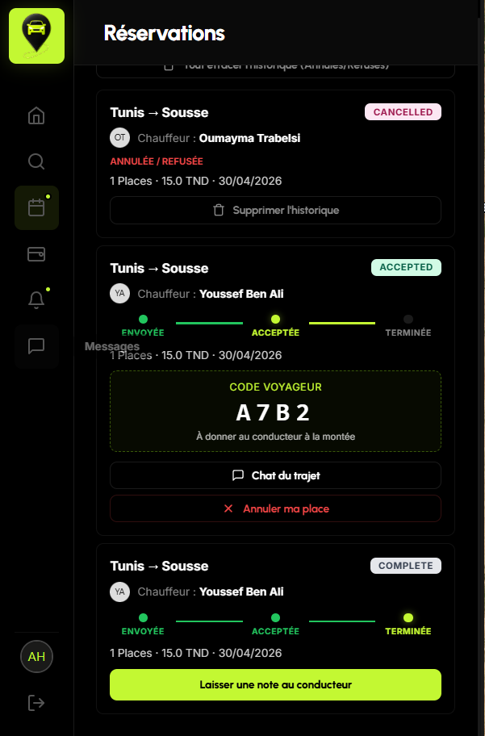
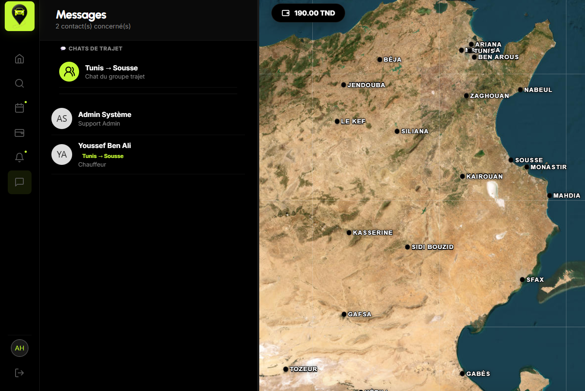
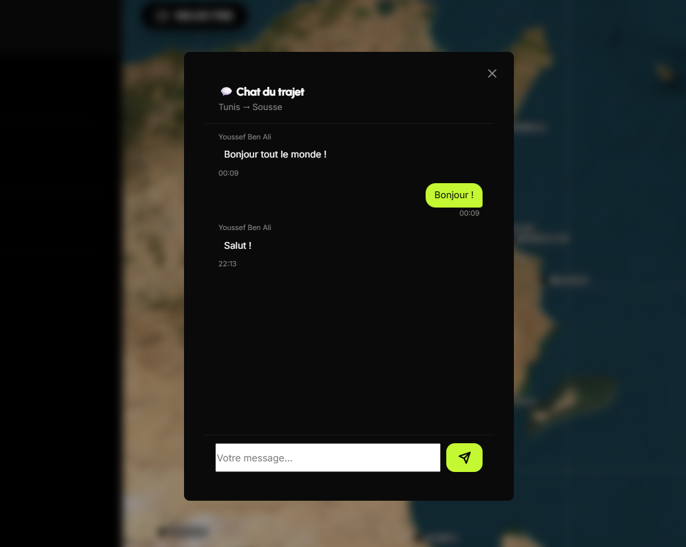
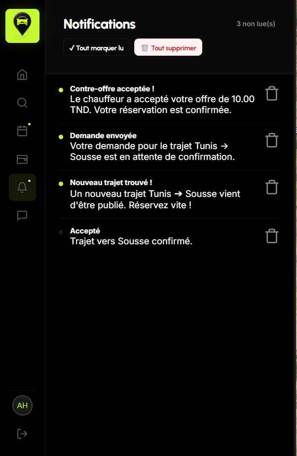
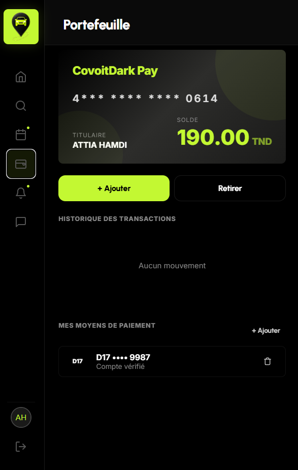
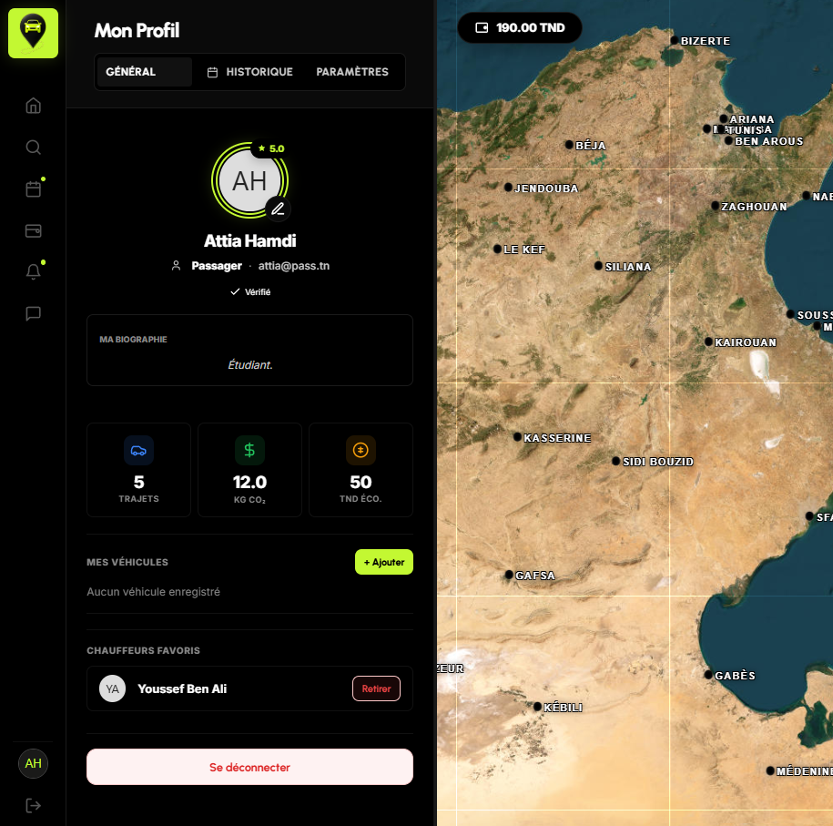

<div align="center">

# 🚗 UberTounsi

### A full-stack carpooling platform built from scratch — no frameworks, no shortcuts.

<br/>


</div>

---

## 🎯 What is UberTounsi?

**UberTounsi** is a production-grade carpooling web application built entirely from the ground up. The backend is a **custom Java HTTP server** using only the JDK's built-in `com.sun.net.httpserver` — no Spring, no Quarkus, no framework magic. The frontend is pure **vanilla HTML, CSS, and JavaScript**.

This project demonstrates deep understanding of:
- How HTTP servers work at the socket level
- Database design and raw JDBC queries
- Session management without frameworks
- Frontend architecture without React or Vue
- Docker containerization of multi-service applications

---

## ✨ Features

| Feature | Description |
|---|---|
| 🔐 **Authentication** | Secure login/register with SHA-256 password hashing + salt |
| 🚦 **Trip Management** | Publish, search, filter, and book carpooling trips |
| 📅 **Recurring Trips** | Schedule trips with repeat days and date ranges |
| 💬 **Real-time Messaging** | WebSocket-powered chat between drivers and passengers |
| 🔔 **Notifications** | Live notification system with WebSocket push |
| 💳 **Wallet System** | In-app balance, top-up, and ride payments |
| ⭐ **Ratings & Reviews** | Mutual rating system post-trip |
| 🛡️ **Admin Dashboard** | Full user management, reports, audit logs, dispute resolution |
| 🎫 **Promo Codes** | Discount system with fixed or percentage codes |
| 🚗 **Car Management** | Drivers can register and manage multiple vehicles |
| 🔒 **Account Security** | Auto-lock after failed login attempts |
| 🌍 **Women-Only Trips** | Optional filter for female-only rides |

---

## 🏗️ Architecture



---

## 📸 Screenshots

### 🏠 Landing Page


---

### 🔐 Authentication
| Login | Register |
|---|---|
|  |  |

---

### 🗺️ Trip Dashboard & Map


---

### 🔍 Search


---

### ✏️ Publish & Manage Trips
| Create a Trip | My Reservations |
|---|---|
|  |  |

---

### 🚗 Car Management


---

### 💬 Messaging & Chat
| Direct Messages | Trip Group Chat |
|---|---|
|  |  |

---

### 🔔 Notifications & Wallet
| Notifications | Wallet |
|---|---|
|  |  |

---

### 👤 Profile & Settings
| Profile | Settings |
|---|---|
|  |  |

---

### 🛡️ Admin Panel
| User Management | Analytics |
|---|---|
|  |  |

---

## 🚀 Quick Start — Run with Docker

> **Requirements:** [Docker Desktop](https://www.docker.com/products/docker-desktop/) only. Nothing else needed.

```bash
# 1. Clone the repository
git clone https://github.com/AmyynJendly/UberTounsi.git
cd UberTounsi

# 2. Start everything (builds the app, starts MySQL, seeds data)
docker-compose up --build

# 3. Open the app
# → http://localhost:8080/welcome.html
```

That's it. Docker handles the full Maven build, database initialization, and data seeding automatically.

### 🔑 Demo Credentials

| Role | Email | Password |
|---|---|---|
| 👑 Admin | `admin@covoitdark.tn` | `Admin1234!` |
| 🚗 Driver | Register a new account | Choose `Driver` role |
| 🧍 Passenger | Register a new account | Choose `Passenger` role |

> The database comes pre-seeded with sample trips, users, and bookings so you can explore all features immediately.

---

## 🛠️ Manual Setup (without Docker)

<details>
<summary>Click to expand</summary>

### Prerequisites
- **Java JDK 21** (with `JAVA_HOME` set)
- **Apache Maven 3.9+**
- **MySQL 8.0+** (with `mysql` in PATH)

### Steps

**1. Clone the repo**
```bash
git clone https://github.com/AmyynJendly/UberTounsi.git
cd UberTounsi
```

**2. Initialize the database**
```cmd
reset_and_seed.bat
```
*(You will be prompted for your MySQL root password)*

**3. Start the server**
```cmd
start_server.bat
```

**4. Open the app**
```
http://localhost:8080/welcome.html
```

</details>

---

## 📂 Project Structure

```
UberTounsi/
├── src/
│   └── main/java/com/covoitdark/
│       ├── App.java                  # HTTP server + all route handlers (2400+ lines)
│       ├── controllers/              # Business logic (17 controllers)
│       ├── dao/                      # Database access layer (21 DAOs, raw JDBC)
│       ├── models/                   # Domain models (User, Trip, Request, etc.)
│       ├── utils/                    # PasswordUtils, SessionManager
│       └── websocket/                # WebSocket notification server
├── web_ui/
│   ├── index.html                    # Main SPA shell
│   ├── auth.html                     # Login / Register page
│   ├── welcome.html                  # Landing page
│   ├── css/                          # Stylesheets
│   └── js/
│       ├── api.js                    # All API calls
│       ├── ui.js                     # Core UI logic
│       └── views/                    # Page-specific view renderers
├── db/
│   ├── schema.sql                    # Full database schema (19 tables)
│   └── seed.sql                      # Sample data for development
├── UML/                              # Architecture and class diagrams
├── Dockerfile                        # Multi-stage build (Maven → JRE)
├── docker-compose.yml                # App + MySQL with health checks
├── pom.xml                           # Maven dependencies
└── start_server.bat                  # Windows dev launch script
```

---

## 📡 API Reference

The backend exposes a REST API on port `8080`. Key endpoints:

| Method | Endpoint | Description |
|---|---|---|
| `POST` | `/api/auth/login` | Authenticate user |
| `POST` | `/api/auth/register` | Create new account |
| `GET` | `/api/auth/current-user` | Get logged-in user |
| `GET` | `/api/trips/all` | List all active trips |
| `POST` | `/api/trips/publish` | Publish a new trip |
| `GET` | `/api/trips/search` | Search trips by route |
| `POST` | `/api/trips/book` | Book a seat on a trip |
| `GET` | `/api/bookings/my` | Get my bookings |
| `POST` | `/api/bookings/respond` | Accept/reject a booking |
| `GET` | `/api/messages/history` | Get message history |
| `POST` | `/api/messages/send` | Send a message |
| `GET` | `/api/notifications/list` | Get notifications |
| `GET` | `/api/stats/my` | Get user statistics |
| `POST` | `/api/ratings/add` | Submit a rating |
| `GET` | `/api/admin/users` | (Admin) List all users |
| `POST` | `/api/admin/block-user` | (Admin) Block a user |

> WebSocket real-time events run on port `8081`.

---

## 🗄️ Database Schema

19 tables covering the full domain:

`users` · `cars` · `trips` · `requests` · `ratings` · `messages` · `notifications` · `reports` · `blocks` · `badges` · `saved_searches` · `stats` · `otp_verifications` · `promo_codes` · `driver_favorites` · `trip_chat_messages` · `disputes` · `audit_log` · `payment_methods`

---

## 👨‍💻 Author

**Amyyn Jendly** — Built as a full-stack engineering portfolio project.

[](https://github.com/AmyynJendly)

---

## 📄 License

This project is licensed under the **MIT License** — see [LICENSE](LICENSE) for details.
